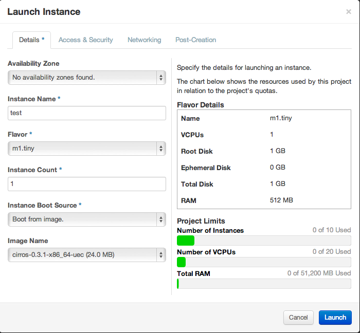
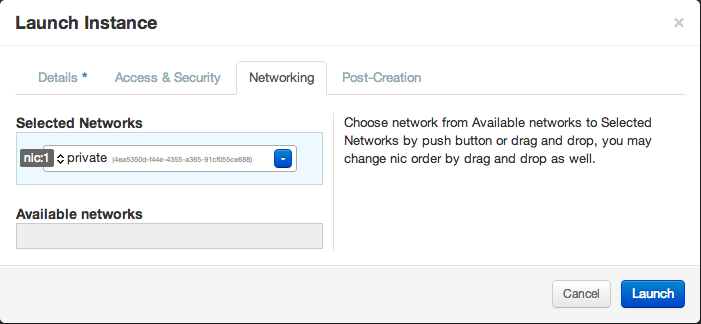
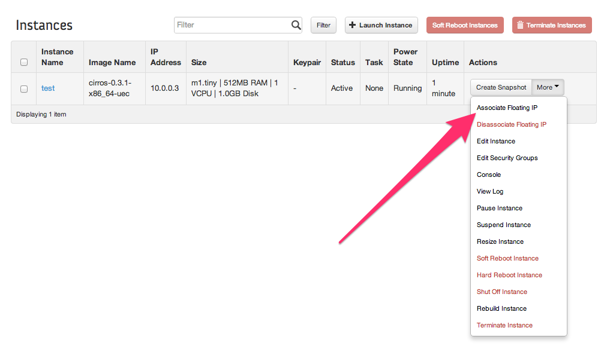
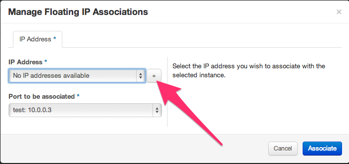

# Dashboard

You should now be able to access the dashboard by pointing your web browser
at the public IP of your instance.

 * Username: demo
 * Password: (see `ADMIN_PASSWORD` variable in `/opt/stack/devstack/localrc`)

## Create a security group that allows ssh and ping

We are going to create a new security group that only allows ssh (port 22)
and ping (icmp) traffic.

1. Click "CURRENT PROJECT" at the left and select "demo"

1. Click "Access & Security" at the left.

1. Click "Create Security Group"

1. Fill in the following fields:

  * Name: ssh
  * Description: allow ssh and ping

1. Click "Create Security Group"

1. Click "Edit Rules" on the "ssh" Security group

1. Click "Add Rule"

1. Fill in the following fields:

  * Rule: Custom TCP Rule
  * Direction: Ingress
  * Open Port: Port
  * Port: 22
  * Remote: CDIR
  * CIDR: 0.0.0.0/0

1. Click "Add"

1. Click "Add Rule"

1. Fill in the following fields

  * Rule: ALL ICMP
  * Direction: Ingress
  * Remote: CIDR
  * CIDR: 0.0.0.0/0

1. Click "Add"

## Launch an instance inside of DevStack

Make sure the CURRENT project is on "demo".

1. Click the "Instances" link on the left, and click "Launch instance" at the top-right

    * Availability Zone: nova
    * Instance Name: test
    * Flavor: m1.tiny
    * Instance Count: 1
    * Instance Boot Source: Boot from image.
    * Image Name: cirros-0.3.1-x86_64-uec (24.0 MB)

    

1. Click "Access & Security"

1. Under "Security Groups", select "ssh" and unselect "default"

    We aren't going to specify a keypair in this case, since we'll be logging
    into the instance with user name and password. However, in typical usage,
    you'd specify a public ssh key that you'd use to ssh into it.

1. Click "Networking"

1. Click the blue "+" on the "private" in "Available networks". It should move to "Selected Networks"

    

1. Click "Launch"

## Allocate a floating IP and attach to an instance

By default, OpenStack instances aren't reachable without a floating IP.

1. At the "Instances" view, click "More" under Actions and choose "Associate
floating IP".

    

1. Click the "+" next to "No IP addresses available" to alllocate a new
floating IP.

    

1. Click "Allocate IP" to allocate an IP address from the "public" pool.

1. Click "Associate" to associate the IP address with the instance.

1. Wait a few seconds, then reload your web browser

You should eventually see two IP addresses in the "IP address field which are most likely:

 * 10.0.0.3
 * 172.24.4.227

`10.0.0.3` is your fixed IP, and `172.24.4.227` if your floating IP.

Try to ssh to the floating IP address: 172.24.4.227 as the user `cirros`:

    $ ssh cirros@172.24.4.227

The password is: `cubswin:)`

You should see the following output:

    The authenticity of host '172.24.4.227 (172.24.4.227)' can't be established.
    RSA key fingerprint is b4:6f:8b:86:e8:8b:73:56:ac:3d:c2:ab:57:7e:eb:7f.
    Are you sure you want to continue connecting (yes/no)? yes
    Warning: Permanently added '172.24.4.227' (RSA) to the list of known hosts.
    cirros@172.24.4.227's password:
    $

## Create and  attach a volume

In the dashboard:

1. Click "Volumes" at the left
1. Click "Create Volume"
1. Name it "myvolume", of size 1 GB. Leave other values as defaults.
1. Click "Create Volume"

When the volume status becomes "Available":

1. Click "Edit Attachments"
1. Select "test" as the instance
1. Specify "/dev/vdb" as the device name
1. Click "Attach Volume"

Inside of your cirros instance, you should now see a /dev/vdb device. You can
format it and mount it, as before:

    $ sudo mkfs.ext4 /dev/vdb
    $ sudo mount /dev/vdb /mnt

