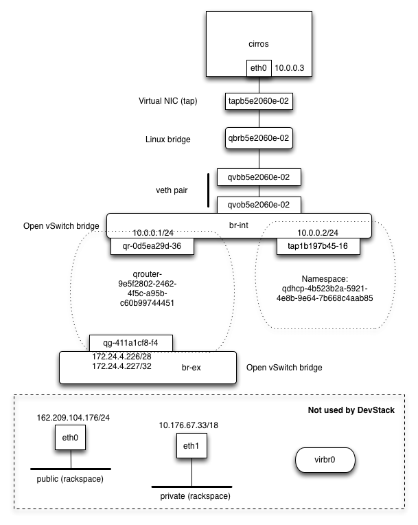

# Under the hood: networking

The networking is the most complex aspect of OpenStack. When you are running
one virtual machine with a floating IP attached, your current DevStack
deployment should have networking that has several virtual network interfaces
(tap devices, veth pairs, Linux bridges, Open vSwitch bridges).



Note that the exact name of the networking devices will vary, although the
prefixes (`tap`, `qbr`, `qvb`, `qvo`, `qr-`, `qg-`, `br`) will be the same.


All devices attached directly to Open vSwitch bridges are "internal ports",
which are implemented as tap devices.


You can list network interfaces by doing:

    $ ip a

Note that not all of the network interfaces will appear in the list, because
some are in different network namespaces.


Also note that `eth0`, `eth1`, and `virbr0` are not involved here. In a production
deployment, the br-ex bridge would be connected to a physical interface
such as eth0.  The `virbr0` bridge is a bridge created by libvirt that is
not used by OpenStack.

## Security groups

OpenStack uses iptables to implement security groups. The rules are applied
to the virtual NIC (in the example above, `tapb5e2060e-02`).

The name of the iptables chaian that controls the inbound rules for the instance
with virtual NIC `tapb5e2060e-02` is called `neutron-openvswi-ib5e2060e-0`.

Try to identify the name of the chain for your instance and list the rules. In
the example above, it's:

```
$ iptables -L neutron-openvswi-ib5e2060e-0
Chain neutron-openvswi-ib5e2060e-0 (1 references)
target     prot opt source               destination
DROP       all  --  anywhere             anywhere             state INVALID
RETURN     all  --  anywhere             anywhere             state RELATED,ESTABLISHED
RETURN     tcp  --  anywhere             anywhere             tcp dpt:ssh
RETURN     icmp --  anywhere             anywhere
RETURN     udp  --  10.0.0.2             anywhere             udp spt:bootps dpt:bootpc
neutron-openvswi-sg-fallback  all  --  anywhere             anywhere
```

Recall that we specified inbound traffic allowed on tcp port 22, and icmp.

This rule allows the tcp inbound connections on the ssh port (22):

    RETURN     tcp  --  anywhere             anywhere             tcp dpt:ssh

This rule allows the inbound traffic

    RETURN     icmp --  anywhere             anywhere

Ideally, the virtual NIC would connect directly to the `br-int` Open vSwitch
bridge. Unfortunately, due to an incompatibility between Open vSwitch and
iptables, it is necessary to add a Linux bridge and a veth pair as a workaround
to provide the L2 connectivity between the virtual NIC and `br-int`, while
still having iptables rules apply to the virtual NIC interface.


## Network namespaces


OpenStack Networking uses network namespaces to isolate networks by providing
an isolated virtual networking stack. In particular, each network namespace
has its own:

 * network interfaces
 * routing table
 * iptables rules

To list the network namespaces, do:

    $ sudo ip netns list

The output should look something like this:

    qrouter-9e5f2802-2462-4f5c-a95b-c60b99744451
    qdhcp-4b523b2a-5921-4e8b-9e64-7b668c4aab85

As we'll see, you can also run an arbitrary commands inside of a network
namespace using `ip netns exec <namespace> <command>`.


## Open vSwith bridges

Try listing the Open vSwitch bridges, and the ports on each bridge:

    $ sudo ovs-vsctl list-br
    $ sudo ovs-vsctl list-ports br-int
    $ sudo ovs-vsctl list-ports br-ex

You should be able to see ports that are attached to Open vSwtich bridges even
if they are inside of a network namespace.

## DHCP service

The `qdhcp-` network namespace contains the interface where the DHCP server
listens for DHCP requsests from instances.

There should be a `tap` device inside of the qdhcp- namespace. If you
execute the `ip a` command inside of the namespace, it will list all of the
networking devices.

    $ sudo ip netns exec qdhcp-4b523b2a-5921-4e8b-9e64-7b668c4aab85 ip a

OpenStack uses dnsmasq for the networking. Ensure the dnsmasq service is
lsitening on the appropriate `tap` device by doing:

    $ ps ww `pgrep dnsmasq`

Look for the `--interface` argument to determine which interface it is listening
on..


## Routing and floating IPs

Layer 3 routing and floating IPs are implemented inside of the `qrouter-`
namespace.

The `qg-` network interface will have its own IP address, and will also be
assigned an IP address for each floating IP.

Look at how the routing is configured between the OpenStack private network (10.0.0.0/24)
and the OpenStack public network (172.24.2.)

   $ sudo ip netns exec qrouter-9e5f2802-2462-4f5c-a95b-c60b99744451 ip route show


Floating IPs are implemented using iptables rules for doing network address
translation.

Look at the rules for the `nat` inside of your `qrouter` namespace


    $ sudo ip netns exec qrouter-9e5f2802-2462-4f5c-a95b-c60b99744451 iptables -t nat -S


You should see commands for doing the NAT from 172.24.4.227 to 10.0.0.3, such as:

```
-A neutron-l3-agent-OUTPUT -d 172.24.4.227/32 -j DNAT --to-destination 10.0.0.3
...
-A neutron-l3-agent-float-snat -s 10.0.0.3/32 -j SNAT --to-source 172.24.4.227
```

You can also see the rule for routing from the metadata service (`169.254.169.254`):

```
-A neutron-l3-agent-PREROUTING -d 169.254.169.254/32 -p tcp -m tcp --dport 80 -j REDIRECT --to-ports 9697
```


You've completed the exercises! You can also try [generating a temporary url]
with object storage.

Finally, please [clean up] so somebody else can use your account.

[generating a temporary url]: temp-url.md
[clean up]: cleanup.md